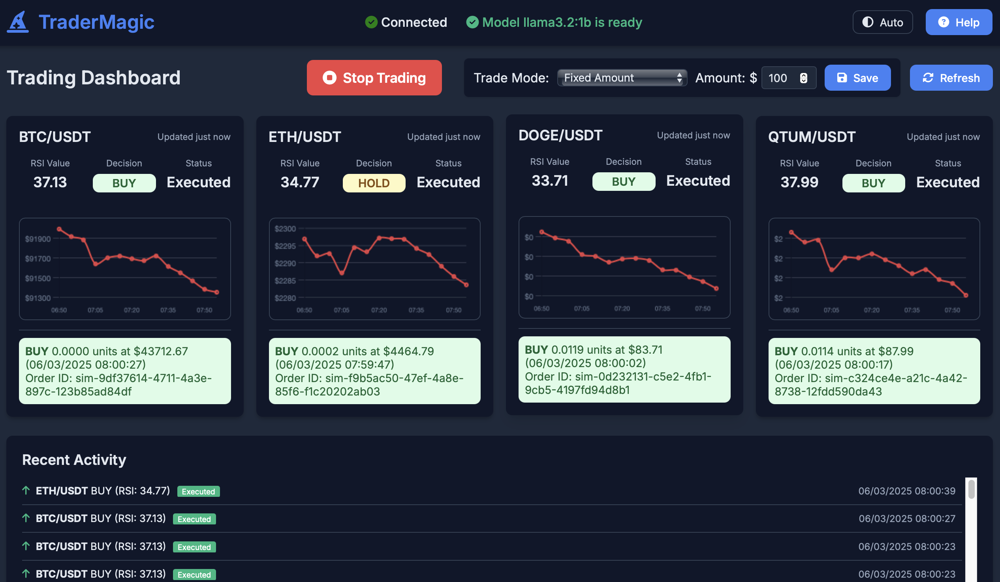

# TraderMagic 🧙‍♂️💹

An AI-powered automated trading system built with Python, running entirely on your local machine. The system uses Ollama for AI decision-making, TAAPI.io for technical indicators, and Alpaca for trade execution.

## ✨ Features

- 🧠 **AI-powered trading decisions** using locally-run LLM models via Ollama
- 📊 **Real-time dashboards** with trade status and history
- 🛑 **Trading on/off toggle** for complete user control
- 📈 **RSI-based technical analysis** for market insights
- 🕒 **Market hours visualization** showing pre-market, regular hours, after-hours, and closed sessions
- 💰 **Flexible trade sizing** with portfolio percentage or fixed amounts
- 🔒 **Paper trading mode** for risk-free testing
- 🔄 **Redis-powered communication** between services
- 🐳 **Docker-based deployment** for easy setup

## 🏗️ System Architecture

TraderMagic consists of four main components:

1. **Data Retrieval Service** 📡 - Polls TAAPI.io for RSI data
2. **AI Decision Engine** 🧠 - Analyzes data using Ollama LLM to make trading decisions
3. **Trade Execution Service** 💹 - Interfaces with Alpaca to execute trades
4. **Web Dashboard** 🖥️ - Real-time monitoring interface

All components are containerized using Docker and communicate through Redis.

## 🚀 Quick Start

```bash
# Clone the repository
git clone https://github.com/rawveg/trader-magic.git
cd trader-magic

# Configure your environment
cp .env.sample .env
# Edit .env with your API keys

# Start the application
docker compose up -d

# Access the dashboard
# Open http://localhost:9753 in your browser
```

## 📚 Documentation

For detailed documentation on all aspects of TraderMagic, check out these guides:

- [📋 Installation Guide](docs/installation.md) - Step-by-step setup instructions
- [🏗️ Architecture Overview](docs/architecture.md) - System design and components
- [🔌 API Integrations](docs/api-integration.md) - Configuring external APIs
- [🚦 Trading Modes](docs/trading-modes.md) - Paper/live trading and debug modes
- [📊 Dashboard Features](docs/dashboard.md) - Using the web interface
- [🔍 Troubleshooting Guide](docs/troubleshooting.md) - Solving common issues

## ⚠️ Disclaimer

This trading system is provided for educational and research purposes only. The authors and contributors are not responsible for any financial losses incurred through the use of this software. Always do your own research and consider consulting a financial advisor before making investment decisions.

## 🙏 Acknowledgments

TraderMagic is inspired by the work of [Mike Russell and the Creator Magic Community](http://www.creatormagic.ai). His innovations in AI-powered creative tools have been pivotal in the development of this project.

## 📜 License

TraderMagic is licensed under the MIT License. See the [LICENSE](LICENSE) file for details.